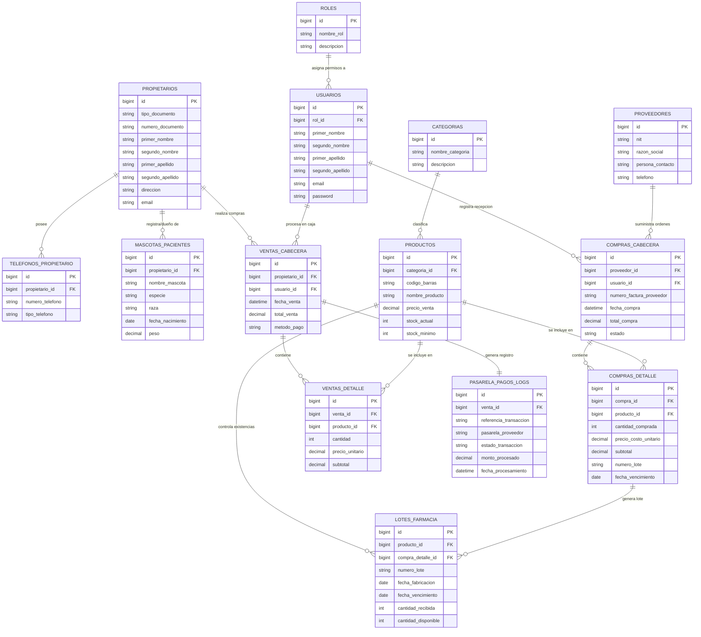

# Diagrama Entidad-Relación (MER) - VetPets ERP

## 🔗 Resumen de Relaciones y Cardinalidades

| Entidad Origen | Entidad Destino | Tipo de Relación | Explicación |
| :--- | :--- | :---: | :--- |
| `ROLES` | `USUARIOS` | **$1:N$** | Un rol asigna permisos a múltiples usuarios. |
| `PROPIETARIOS` | `TELEFONOS_PROPIETARIO` | **$1:N$** | Un propietario puede registrar $N$ números de contacto. |
| `PROPIETARIOS` | `MASCOTAS_PACIENTES` | **$1:N$** | Un propietario puede ser dueño de $N$ mascotas. |
| `PROPIETARIOS` | `VENTAS_CABECERA` | **$1:N$** | Un propietario realiza $N$ compras/facturas. |
| `USUARIOS` | `VENTAS_CABECERA` | **$1:N$** | Un cajero/usuario atiende $N$ facturas de venta. |
| `USUARIOS` | `COMPRAS_CABECERA` | **$1:N$** | Un usuario registra la recepción de $N$ órdenes de compra. |
| `CATEGORIAS` | `PRODUCTOS` | **$1:N$** | Una categoría agrupa múltiples productos. |
| `PROVEEDORES` | `COMPRAS_CABECERA` | **$1:N$** | Un proveedor suministra $N$ órdenes/facturas de compra. |
| `COMPRAS_CABECERA` | `COMPRAS_DETALLE` | **$1:N$** | Una orden de compra contiene $N$ ítems de productos. |
| `COMPRAS_DETALLE` | `LOTES_FARMACIA` | **$1:N$** | Un detalle de compra genera $N$ registros de lotes recibidos. |
| `PRODUCTOS` | `LOTES_FARMACIA` | **$1:N$** | Un producto de farmacia maneja $N$ lotes de expiración. |
| **`VENTAS_CABECERA`** | **`PRODUCTOS`** | **$N:M$** | **Muchos a Muchos:** Resuelta mediante la tabla pivote `VENTAS_DETALLE` ($1:N$). |
| **`PROVEEDORES`** | **`PRODUCTOS`** | **$N:M$** | **Muchos a Muchos:** Resuelta mediante el historial de compra `COMPRAS_CABECERA` / `COMPRAS_DETALLE` ($1:N$). |
| **`VENTAS_CABECERA`** | **`PASARELA_PAGOS_LOGS`** | **$1:1$** | **Uno a Uno:** Cada factura electrónica genera 1 log de pago en pasarela. |
