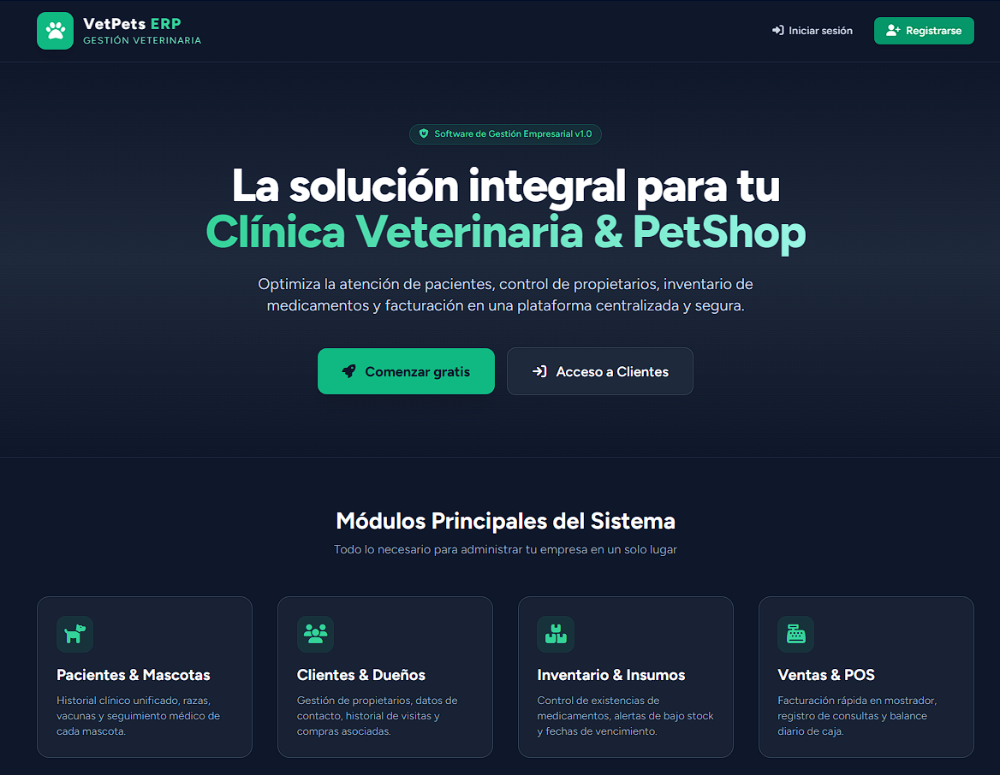
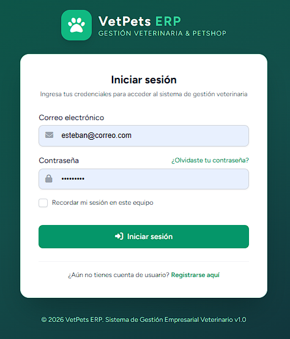
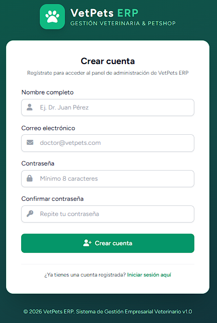
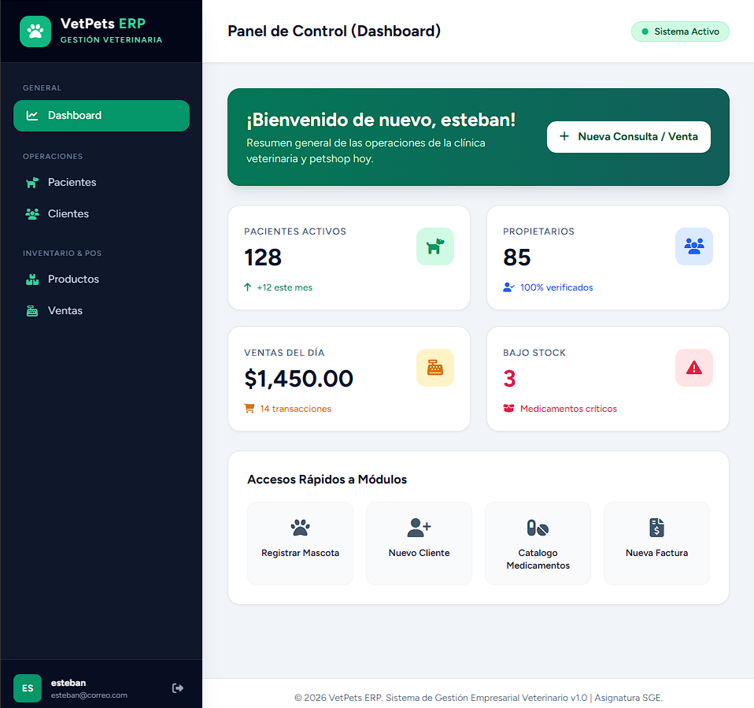

# VetPets ERP - Sistema de Gestión Empresarial Veterinario

**VetPets ERP** es una plataforma web desarrollada en **Laravel**, diseñada para la administración integral de Clínicas Veterinarias y Tiendas de Mascotas (PetShop).

**Integrantes:** Jhon Esteban Molina Ecahvarria - Heiber Lozano Mercado

---

## 📸 Vista Previa del Sistema

| Landing Page (Página de Inicio) | Login Personalizado |
|---|---|
|  |  |

| Registro de Usuarios | Panel de Control (Dashboard con KPIs) |
|---|---|
|  |  |

---

## 🏛️ Estructura del Repositorio

```text
ERP_Veterinaria/
├── app/                       # Modelos, Controladores y Lógica de Negocio
├── config/                    # Configuración de Laravel y Servicios
├── database/                  # Migraciones y Seeders de la Base de Datos
├── docs/                      # Documentación del Proyecto e Investigación
│   ├── analisis.md            # Documento de Análisis del Negocio
│   ├── diagrama_mer.md        # Modelo Entidad-Relación (MER)
│   └── visual/                # Capturas de pantalla del Sistema
│       ├── captura_1_landing.png
│       ├── captura_2_login.png
│       ├── captura_3_registro.png
│       └── captura_4_dashboard.png
├── public/                    # Archivos públicos y assets compilados
├── resources/                 # Vistas Blade, estilos Tailwind y JavaScript
├── routes/                    # Rutas web y autenticación (web.php, auth.php)
├── storage/                   # Almacenamiento local y logs
├── compose.yaml               # Configuración de Docker Sail
├── composer.json              # Dependencias de PHP / Laravel
├── package.json               # Dependencias de Node.js / Vite / Tailwind
└── README.md                  # Documentación principal del repositorio
```

---

## 📄 Documentación del Proyecto

* 📋 **[Análisis del Negocio](docs/analisis.md)**: Descripción del giro del negocio, 3 procesos clave (Ventas, Compras, Inventario) y respuestas a preguntas de gestión.
* 🗂️ **[Diagrama Entidad-Relación](docs/diagrama_mer.md)**: Especificación de entidades, llaves primarias/foráneas y relaciones ($1:1$, $1:N$, $N:M$).
* 🖼️ **[Evidencias Visuales](docs/visual/)**: Capturas de pantalla de la interfaz personalizada (Clase 4).

---

## 🚀 Despliegue Local con Docker Sail

1. **Clonar el repositorio:**
   ```bash
   git clone https://github.com/moliech/ERP_Veterinaria.git
   cd ERP_Veterinaria
   ```

2. **Levantar los contenedores de Docker:**
   ```bash
   ./vendor/bin/sail up -d
   ```

3. **Ejecutar migraciones de base de datos:**
   ```bash
   ./vendor/bin/sail artisan migrate
   ```

4. **Acceso al sistema en el navegador:**
   - Landing Page: **`http://localhost`** (o **`http://localhost:8060`**)
   - Login: **`http://localhost/login`**
   - Registro: **`http://localhost/register`**
   - Dashboard: **`http://localhost/dashboard`**

---

## 🎨 Identidad Gráfica y Tecnologías

- **Paleta de Colores:** Verde Esmeralda Corporativo (`#059669`), Slate Dark (`#0f172a`) y Grises Neutros (`#f8fafc`).
- **Librerías:** Laravel Breeze, Tailwind CSS, Font Awesome 6.5 (Iconografía Veterinaria), Alpine.js.
- **Entorno:** PHP 8.x, MySQL/MariaDB, Docker Sail, Node.js 22 LTS.
