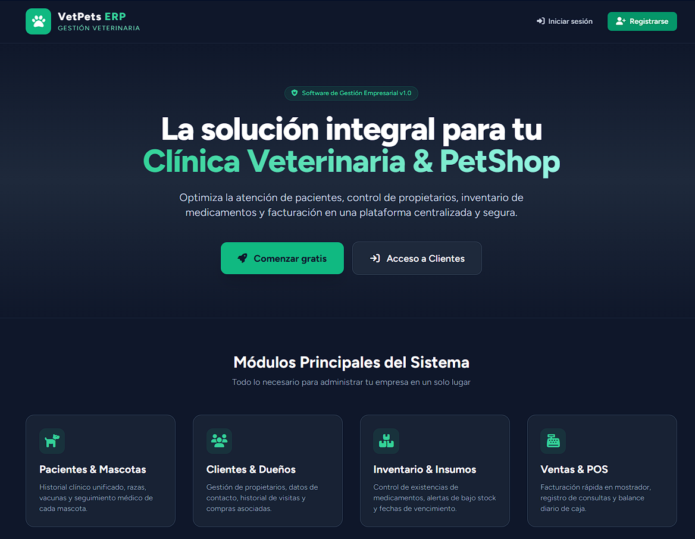
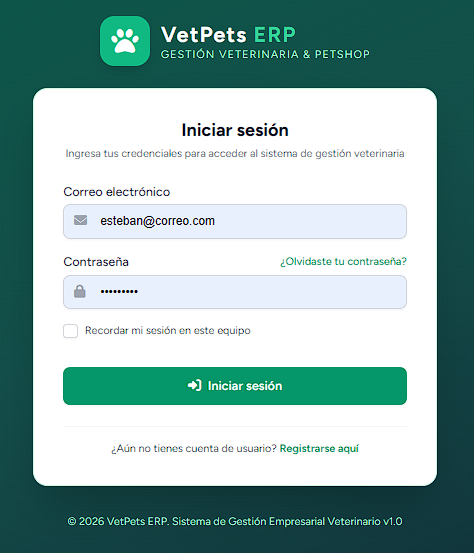
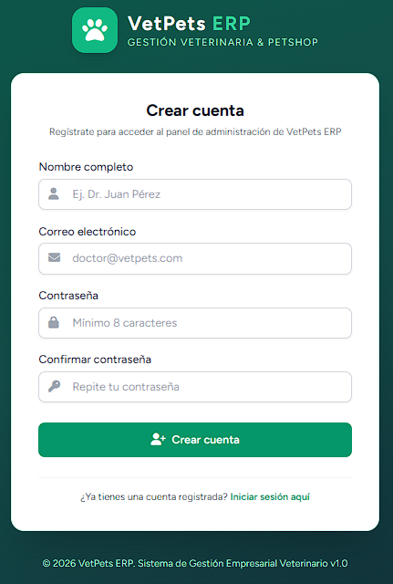
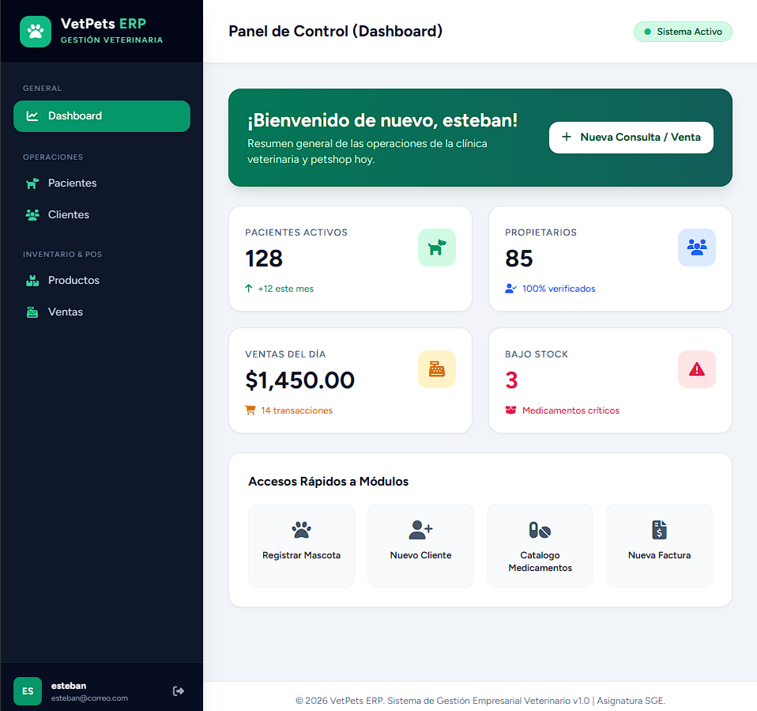

# VetPets ERP - Sistema de Gestión Empresarial Veterinario

**VetPets ERP** es una plataforma web desarrollada en **Laravel 11+**, diseñada para la administración integral de Clínicas Veterinarias y Tiendas de Mascotas (PetShop).

**Integrantes:** Jhon Esteban Molina Echavarria - Heiber Lozano Mercado  
**Asignatura:** Software de Gestión Empresarial (COTECNOVA)

---

## 🛠️ Estado del Proyecto (Avanzado hasta Clase 8: Roles, Permisos & Soft Delete)

El sistema cuenta con la arquitectura de base de datos traducida a **Migraciones**, **Modelos Eloquent** con relaciones de entidad, **Seeders** con datos de prueba, **Soft Delete (Borrado Lógico)** en Entidades Clave y el sistema de Control de Acceso Basado en Roles (RBAC) con **Spatie Laravel-Permission**, **Form Requests** y protección de vistas con directivas `@can`.

### 🗄️ Módulos y Entidades del Sistema

| Módulo | Entidad / Tabla | Modelo Eloquent | Característica Especial | Descripción |
| :--- | :--- | :--- | :---: | :--- |
| **Catálogo** | `categories` | `Category` | ♻️ `SoftDeletes` | Clasificación de servicios médicos y productos. |
| **Productos** | `products` | `Product` | ♻️ `SoftDeletes` | Catálogo con precios, stock actual, mínimo y categoría. |
| **Proveedores** | `providers` | `Provider` | N/A | Registro de laboratorios e insumos médicos. |
| **Clientes** | `owners` | `Owner` | N/A | Expedientes de propietarios de mascotas. |
| **Teléfonos** | `owner_phones` | `OwnerPhone` | N/A | Contactos telefónicos de los propietarios. |
| **Pacientes** | `pets` | `Pet` | N/A | Historias biológicas de las mascotas atendidas. |
| **Seguridad** | `roles` / `permissions` | Spatie Models | 🛡️ `Spatie RBAC` | Matriz de permisos por rol (`admin`, `almacenista`, `vendedor`). |

---

## 🔑 Credenciales y Matriz de Roles (Spatie RBAC)

* **Servidor Local:** **`http://localhost:8060`**
* **Página de Login:** **`http://localhost:8060/login`**

| Usuario / Correo | Contraseña | Rol Asignado | Permisos Concedidos |
| :--- | :--- | :---: | :--- |
| **`admin@vetpets.com`** | `password123` | **Administrador (`admin`)** | Acceso total (Ver, crear, editar, eliminar y restaurar en todos los módulos). |
| **`esteban@vetpets.com`** | `password123` | **Almacenista (`almacenista`)** | Gestión completa de productos y categorías (Ver, crear y editar). |
| **`heiber@vetpets.com`** | `password123` | **Vendedor (`vendedor`)** | Consulta de productos/categorías y gestión de clientes y pacientes. |

---

## 📸 Evidencias Técnicas e Interfaz del Sistema (Clase 8)

### 🛡️ 1. Estructura de Roles y Permisos en MySQL
Muestra la semilla de roles (`admin`, `vendedor`, `almacenista`) y permisos creados mediante Spatie:


### ⚡ 2. Verificación de Asignación de Roles en Laravel Tinker
Comprobación en tiempo de ejecución del rol del usuario mediante `$user->hasRole('admin')`:


### 🔐 3. Protección de Controladores mediante `HasMiddleware`
Implementación de `HasMiddleware` e inyección de permisos por acción en controladores de Laravel:


### ♻️ 4. Eliminación Lógica (Soft Delete) y Notificación al Usuario
Envío de un producto a la papelera sin destrucción física de la base de datos:


### 🗃️ 5. Registro de la Columna `deleted_at` en MySQL
Evidencia del timestamp grabado en MySQL en la columna `deleted_at` tras aplicar el Soft Delete:


### 🚫 6. Bloqueo de Seguridad - Error 403 (Acceso Denegado / Forbidden)
Respuesta del sistema al intentar ingresar a una ruta protegida sin contar con el permiso requerido:


---

### 🖥️ Vistas Principales de la Interfaz

| Landing Page (Página de Inicio) | Login Personalizado |
|---|---|
|  |  |

| Registro de Usuarios | Panel de Control (Dashboard) |
|---|---|
|  |  |

---

## 🚀 Despliegue e Inicialización Local (Docker Sail)

Para poner a punto el proyecto desde cero en una máquina local:

```bash
# 1. Clonar el repositorio
git clone https://github.com/moliech/ERP_Veterinaria.git
cd ERP_Veterinaria

# 2. Instalar dependencias de PHP y entorno
composer install
cp .env.example .env
php artisan key:generate

# 3. Levantar contenedores Docker Sail
./vendor/bin/sail up -d

# 4. Ejecutar migraciones y sembrado de datos (Módulos y Roles/Permisos)
./vendor/bin/sail php artisan migrate:fresh --seed
./vendor/bin/sail php artisan db:seed --class=RolePermissionSeeder

# 5. Compilar assets de frontend (Vite / Tailwind)
./vendor/bin/sail npm install
./vendor/bin/sail npm run build
```

---

## 🏛️ Estructura del Repositorio

```text
ERP_Veterinaria/
├── app/                       # Modelos Eloquent y Form Requests (Store/Update Product/Category)
│   ├── Http/Controllers/      # ProductController, CategoryController (con HasMiddleware)
│   ├── Http/Requests/         # FormRequests de validación avanzada
│   └── Models/                # Category, Product (con SoftDeletes), Provider, Owner, Pet
├── database/                  # Migraciones y Seeders (RolePermissionSeeder)
│   ├── migrations/            # Tablas base + SoftDeletes en products/categories + Spatie Tables
│   └── seeders/               # Seeders de dominio y RolePermissionSeeder
├── docs/                      # Documentación Técnica y Evidencias
│   ├── analisis.md            # Documento de Análisis del Negocio
│   ├── diccionario.md         # Diccionario de Datos del Esquema
│   ├── diagrama_mer.md        # Modelo Entidad-Relación (MER en Mermaid)
│   └── visual/                # Capturas de pantalla de la Interfaz y Evidencias Clase 8
├── public/                    # Archivos públicos y manifest compilado por Vite
├── resources/                 # Vistas Blade (@can), estilos Tailwind CSS y JavaScript
├── routes/                    # Rutas web protegidas con auth y restore (web.php)
├── compose.yaml               # Configuración de Docker Sail (Puerto 8060 & MySQL 3306)
├── composer.json              # Dependencias de PHP / Laravel (spatie/laravel-permission)
└── README.md                  # Documentación principal del repositorio
```

---

## 📄 Documentación Técnica

* 📋 **[Análisis de la Empresa](docs/analisis.md)**: Estructura general, procesos clave (Ventas, Compras, Inventarios) y listado de entidades.
* 📖 **[Diccionario de Datos](docs/diccionario.md)**: Especificación técnica detallada de cada tabla, campos, tipos de dato y restricciones.
* 🗂️ **[Diagrama Entidad-Relación](docs/diagrama_mer.md)**: Especificación visual y técnica del MER en sintaxis Mermaid.

---

## 🎨 Identidad Gráfica y Tecnologías

### Paleta de Colores
| Tono | Nombre | Código Hexadecimal | Muestra Visual |
| :--- | :--- | :---: | :---: |
| **Primario Corporativo** | Verde Esmeralda | `#059669` | 🟩 `` |
| **Fondo & Headers** | Slate Dark | `#0f172a` | ⬛ `` |
| **Superficie Neutra** | Grises Neutros | `#f8fafc` | ⬜ `` |

- **Librerías:** Spatie Laravel Permission, Laravel Breeze, Tailwind CSS, Font Awesome 6.5, Alpine.js.
- **Entorno:** PHP 8.x, MySQL 8.4, Docker Sail, Node.js 22 LTS, Vite 6.
