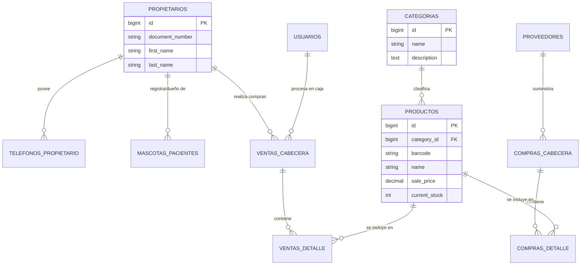

# Análisis de la Empresa

## 1. Datos Generales
- **Nombre:** VetPets ERP (Clínica Veterinaria y Tienda de Mascotas)
- **Giro del negocio:** Prestación de servicios de salud/estética veterinaria y comercialización minorista (POS) de medicamentos, alimentos y accesorios para mascotas.
- **Tamaño:** Pequeña a Mediana Empresa (Pyme).

---

## 2. Procesos Clave
- **Ventas:** Selección de productos o servicios en el punto de venta (POS), emisión de facturas en mostrador, registro de formas de pago y descuento automático de existencias del inventario en tiempo real.
- **Compras:** Generación de órdenes de compra asociadas a proveedores, recepción de mercancía detallada con costo unitario, vinculación de facturas de compra y registro de control de lotes con fechas de vencimiento para medicamentos.
- **Inventario:** Monitoreo continuo de existencias (`current_stock`), alertas por stock mínimo (`minimum_stock`) y trazabilidad de productos farmacéuticos mediante lotes (`Lotes_Farmacia`).
- **Otros:** Registro y expedientes de propietarios (clientes) con múltiples números de contacto, historiales de mascotas (pacientes), control de proveedores y autenticación de usuarios por roles.

### Análisis y Respuestas a Preguntas de Gestión

- **¿Qué información se requiere consolidar de un cliente y su mascota?**  
  Se consolida la información del propietario (nombres, apellidos, documento y teléfonos de contacto) y se vincula con los perfiles de sus mascotas (especie, raza, fecha de nacimiento, peso e historial clínico de atenciones).

- **¿Qué controles específicos de inventario requieren los productos de farmacia?**  
  Los productos farmacéuticos requieren trazabilidad por lote mediante la tabla `Lotes_Farmacia`, registrando el número de lote y la fecha de vencimiento asociada a la compra realizada al proveedor, impidiendo la comercialización o aplicación de insumos caducados.

- **¿Cómo se articula el flujo de ventas y compras con el inventario?**  
  Al ingresar una compra en `Compras_Cabecera` y `Compras_Detalle`, el sistema incrementa el `stock_actual` del producto y crea el registro del lote. Al realizar una venta o formular un insumo en `Ventas_Detalle`, el sistema descuenta automáticamente la cantidad vendida del inventario y del lote correspondiente en tiempo real.

---

## 3. Entidades Identificadas (Tablas)
- `users`: Personal y usuarios autenticados del sistema (Administradores, Veterinarios, Cajeros, Lectores/Consultores).
- `categories`: Clasificación general de productos y servicios (Farmacia, Alimentos, Accesorios, Consultas).
- `products`: Catálogo general de productos e insumos con precio de venta y existencias.
- `providers`: Empresas proveedoras de insumos, medicamentos y alimentos.
- `owners`: Registro de propietarios / clientes responsables de las mascotas.
- `owner_phones`: Números telefónicos de contacto por propietario ($1:N$).
- `pets`: Registro clínico y biológico de las mascotas / pacientes atendidos.
- `compras_cabecera`: Encabezado de órdenes de compra realizadas a proveedores.
- `compras_detalle`: Registro detallado de productos y cantidades recibidas por compra.
- `lotes_farmacia`: Control de lotes, fecha de fabricación y vencimiento de medicamentos.
- `ventas_cabecera`: Registro de facturación de ventas realizadas en mostrador.
- `ventas_detalle`: Detalle de ítems y cantidades vendidas por factura.
- `pasarela_pagos_logs`: Registro auditado de transacciones electrónicas procesadas.

---

## 4. Diccionario de Datos (Mínimo 3 tablas)

> *Nota: Para la especificación técnica extendida de todas las tablas del sistema, consultar el documento [diccionario.md](diccionario.md).*

### Tabla: `categories` (Categorías de Productos)
| Campo | Tipo | Descripción |
| :--- | :--- | :--- |
| `id` | `BIGINT (Unsigned)` | Identificador único de la categoría (PK) |
| `name` | `VARCHAR(100)` | Nombre de la categoría (ej. Farmacia, Alimentos) |
| `description` | `TEXT` | Descripción detallada de la categoría |
| `active` | `BOOLEAN` | Estado lógico (true: activo, false: inactivo) |

### Tabla: `products` (Catálogo de Productos)
| Campo | Tipo | Descripción |
| :--- | :--- | :--- |
| `id` | `BIGINT (Unsigned)` | Identificador único del producto (PK) |
| `category_id` | `BIGINT (Unsigned)` | Clave foránea a la tabla `categories` (FK) |
| `barcode` | `VARCHAR(50)` | Código de barras único para escaneo en POS |
| `name` | `VARCHAR(150)` | Nombre comercial del producto o servicio |
| `sale_price` | `DECIMAL(10,2)` | Precio de venta al público |
| `current_stock` | `INT` | Existencias actuales en inventario |
| `minimum_stock` | `INT` | Stock mínimo para alertas de reabastecimiento |

### Tabla: `owners` (Propietarios / Clientes)
| Campo | Tipo | Descripción |
| :--- | :--- | :--- |
| `id` | `BIGINT (Unsigned)` | Identificador único del propietario (PK) |
| `document_type` | `VARCHAR(10)` | Tipo de documento (CC, CE, PAS, NIT) |
| `document_number` | `VARCHAR(20)` | Número de documento de identidad único |
| `first_name` | `VARCHAR(50)` | Nombres del propietario |
| `last_name` | `VARCHAR(50)` | Apellidos del propietario |
| `email` | `VARCHAR(100)` | Correo electrónico de contacto |

---

## 5. Diagrama Entidad-Relación (MER)

> *Nota: Para la arquitectura completa de relaciones ($1:1$, $1:N$, $N:M$), consultar el documento [diagrama_mer.md](diagrama_mer.md).*

