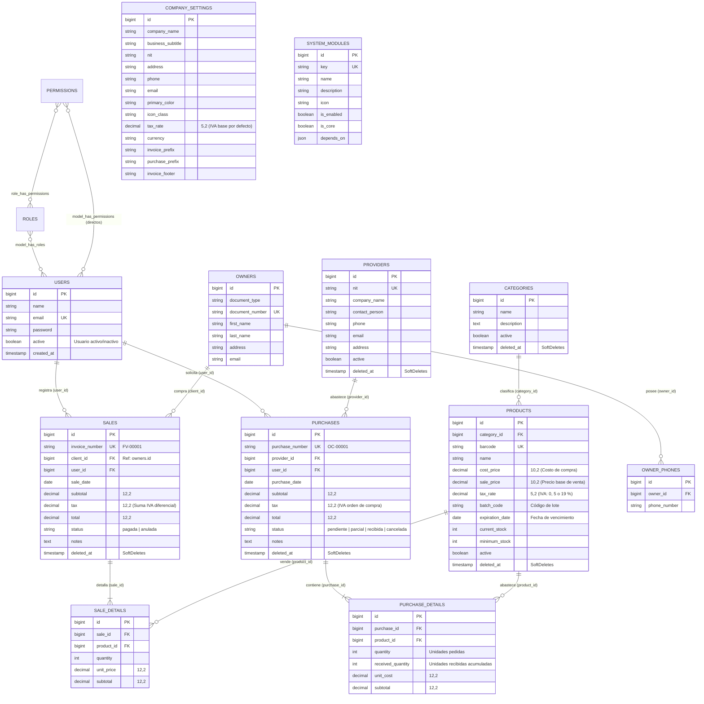

# Diagrama Entidad-Relación (MER) — VetPets ERP (Segundo Corte)

```mermaid
erDiagram
    USERS ||--o{ SALES : "registra (user_id)"
    USERS ||--o{ PURCHASES : "solicita (user_id)"
    ROLES }o--o{ USERS : "model_has_roles"
    PERMISSIONS }o--o{ ROLES : "role_has_permissions"
    PERMISSIONS }o--o{ USERS : "model_has_permissions (directos)"

    CATEGORIES ||--o{ PRODUCTS : "clasifica (category_id)"
    OWNERS ||--o{ OWNER_PHONES : "posee (owner_id)"
    OWNERS ||--o{ SALES : "compra (client_id)"

    PROVIDERS ||--o{ PURCHASES : "abastece (provider_id)"
    PURCHASES ||--|{ PURCHASE_DETAILS : "contiene (purchase_id)"
    PRODUCTS ||--o{ PURCHASE_DETAILS : "abastece (product_id)"

    SALES ||--|{ SALE_DETAILS : "detalla (sale_id)"
    PRODUCTS ||--o{ SALE_DETAILS : "vende (product_id)"

    USERS {
        bigint id PK
        string name
        string email UK
        string password
        boolean active "Usuario activo/inactivo"
        timestamp created_at
    }

    CATEGORIES {
        bigint id PK
        string name
        text description
        boolean active
        timestamp deleted_at "SoftDeletes"
    }

    PRODUCTS {
        bigint id PK
        bigint category_id FK
        string barcode UK
        string name
        decimal cost_price "10,2 (Costo de compra)"
        decimal sale_price "10,2 (Precio base de venta)"
        decimal tax_rate "5,2 (IVA: 0, 5 o 19 %)"
        string batch_code "Código de lote"
        date expiration_date "Fecha de vencimiento"
        int current_stock
        int minimum_stock
        boolean active
        timestamp deleted_at "SoftDeletes"
    }

    OWNERS {
        bigint id PK
        string document_type
        string document_number UK
        string first_name
        string last_name
        string address
        string email
    }

    OWNER_PHONES {
        bigint id PK
        bigint owner_id FK
        string phone_number
    }

    PROVIDERS {
        bigint id PK
        string nit UK
        string company_name
        string contact_person
        string phone
        string email
        string address
        boolean active
        timestamp deleted_at "SoftDeletes"
    }

    PURCHASES {
        bigint id PK
        string purchase_number UK "OC-00001"
        bigint provider_id FK
        bigint user_id FK
        date purchase_date
        decimal subtotal "12,2"
        decimal tax "12,2 (IVA orden de compra)"
        decimal total "12,2"
        string status "pendiente | parcial | recibida | cancelada"
        text notes
        timestamp deleted_at "SoftDeletes"
    }

    PURCHASE_DETAILS {
        bigint id PK
        bigint purchase_id FK
        bigint product_id FK
        int quantity "Unidades pedidas"
        int received_quantity "Unidades recibidas acumuladas"
        decimal unit_cost "12,2"
        decimal subtotal "12,2"
    }

    SALES {
        bigint id PK
        string invoice_number UK "FV-00001"
        bigint client_id FK "Ref: owners.id"
        bigint user_id FK
        date sale_date
        decimal subtotal "12,2"
        decimal tax "12,2 (Suma IVA diferencial)"
        decimal total "12,2"
        string status "pagada | anulada"
        text notes
        timestamp deleted_at "SoftDeletes"
    }

    SALE_DETAILS {
        bigint id PK
        bigint sale_id FK
        bigint product_id FK
        int quantity
        decimal unit_price "12,2"
        decimal subtotal "12,2"
    }

    COMPANY_SETTINGS {
        bigint id PK
        string company_name
        string business_subtitle
        string nit
        string address
        string phone
        string email
        string primary_color
        string icon_class
        decimal tax_rate "5,2 (IVA base por defecto)"
        string currency
        string invoice_prefix
        string purchase_prefix
        string invoice_footer
    }

    SYSTEM_MODULES {
        bigint id PK
        string key UK
        string name
        string description
        string icon
        boolean is_enabled
        boolean is_core
        json depends_on
    }
```
